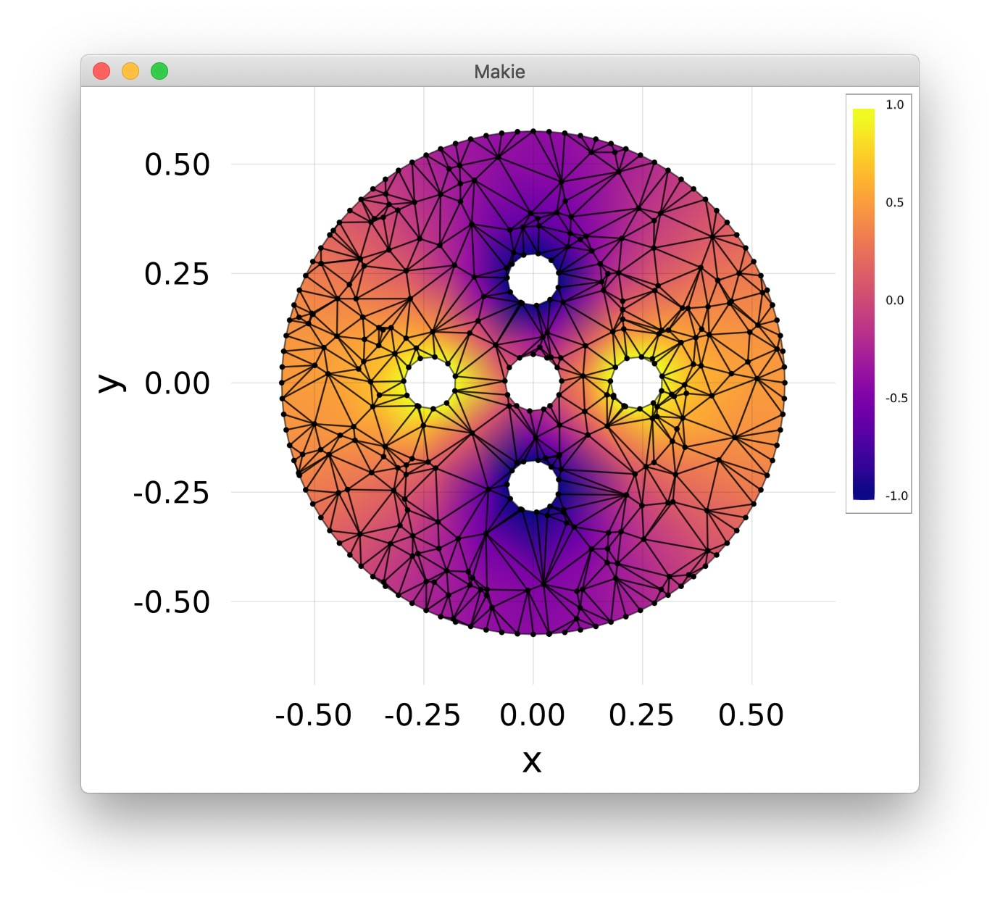

## FEA

FEA from scratch to learn Julia.

Dependencies: Cubature, GeometryTypes, IterativeSolvers, Makie

### Images

Solving Δ<i>u</i> = 0 with <i>u</i> = 1 solution on left/right circles, <i>u</i> = –1
solution on top/bottom circles, and zero flux condition on all other boundaries.

